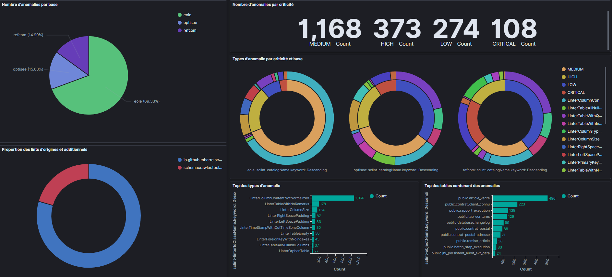
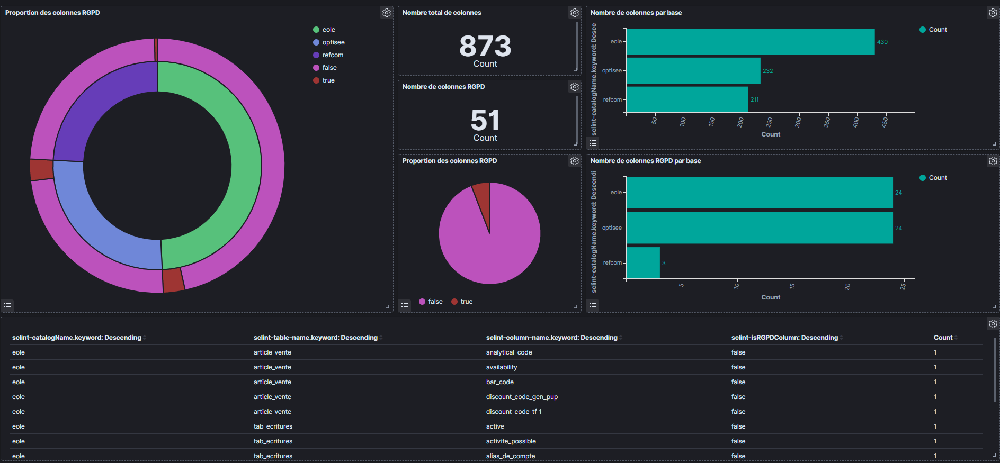
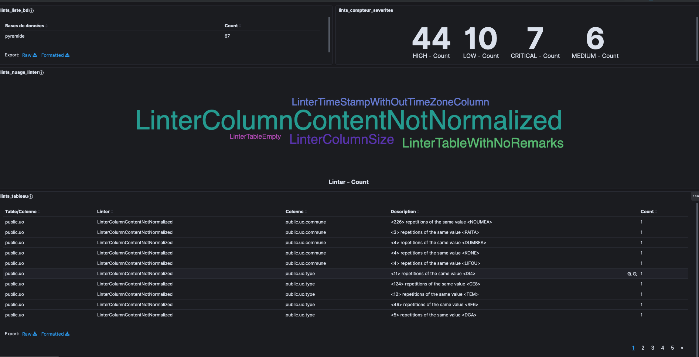

# docker-schemacrawler-reporting

[](https://www.schemacrawler.com "Schemacrawler")
[](https://www.docker.com "Docker")
[](https://docs.docker.com/compose "Docker compose")
[](https://www.elastic.co "ELK")

* [Demo](#bar_chart-demo)
* [Description](#speech_balloon-description)
* [Prerequisites](#books-prerequisites)
  * [Installation](#installation)
  * [Database sample](#database-sample)
  * [Extra documentation](#extra-documentation)
* [How to use](#rocket-how-to-use)
  * [Get the project](#get-the-project)
  * [Fantastic Elastic](#fantastic-elastic)
  * [Logstash is watching you](#logstash-is-watching-you)
  * [Let's analyze the database](#lets-analyze-the-database)
    * [Run schemaCrawler](#run-schemaCrawler)
  * [Jump in Kibana](#jump-in-Kibana)
    * [Create Index pattern](#create-index-pattern)
    * [Beautifuls Dashboards incoming](#beautifuls-dashboards-incoming)
* [Troubleshooting](#gun-Troubleshooting)
  * [No such host on pulling docker images](#no-such-host-on-pulling-docker-images)
* [Usefuls links](#link-usefuls-links)

## :bar_chart: Demo

Some [Kibana Dashboards visuals](https://hakumennc.github.io/docker-schemacrawler-reporting/) produced on top of this project.

  

## :speech_balloon: Description

Use [schemacrawler](https://www.schemacrawler.com) on docker :whale: environment :

* Deploy the entire [ELK](https://www.elastic.co/what-is/elk-stack) `7.9.2` stack
  * [**E**lasticSearch](https://www.elastic.co/what-is/elasticsearch) for data storage
  * [**L**ogstash](https://www.elastic.co/logstash) agent daemon for process newly exported files
  * [**K**ibana](https://www.elastic.co/kibana) for display beautifuls dashboards !
* Launch the schemacrawler's command : [csv](https://github.com/adriens/schemacrawler-additional-command-lints-as-csv)

News calculateds fields (in [ruby](https://www.ruby-lang.org/) :gem:) are added on logstash step :

| field | pipeline | description |
| - | - | - |
| `sclint-isRGPDColumn` | [logstash-columns.conf](logstash/pipeline/logstash-columns.conf) | Is `true` if the column's remark (based on field `sclint-column-remarks`) contains "RGPD" string else `false` |
| `sclint-linterIdClassName` | [logstash-lints.conf](logstash/pipeline/logstash-lints.conf) | Return the className of field `sclint-linterId` |
| `sclint-linterIdPackageName` | [logstash-lints.conf](logstash/pipeline/logstash-lints.conf) | Return the package's path of field `sclint-linterId` |

:bulb: Feel free to create PR or issues for any new ideas of calculateds fields !

## :books: Prerequisites

### Installation

* git : <https://git-scm.com/downloads>
* docker : <https://www.docker.com/get-started>
  * docker-compose : <https://docs.docker.com/compose/install/>
* Verification examples

```sh
$ git --version
git version 2.23.0.windows.1
```

```sh
$ docker -v
Docker version 18.09.6, build c89750f8
```

```sh
$ docker-compose -v
docker-compose version 1.27.4, build 40524192
```

### Database sample

No database on hand? Don't panic, let's go [here](sampledb)

### Extra documentation

* What is [SchemaCrawler](https://www.schemacrawler.com/faq.html#whats-schemacrawler) ?
* What is [ELK](https://www.elastic.co/what-is/elk-stack) ?

## :rocket: How to use

### Get the project

```sh
git clone https://github.com/HakumenNC/docker-schemacrawler-reporting.git
```

```sh
cd docker-schemacrawler-reporting
```

### Fantastic Elastic

* Deploy the Elastic World (in case if we want the all stack on local environnement else use the `ek.yml` file, without Logstash so)

```sh
docker-compose --project-name schemacrawler-elk -f elk.yml up -d
```

* ...And that's all :clap: !

```sh
$ docker ps
CONTAINER ID        IMAGE                                                 COMMAND                  CREATED             STATUS              PORTS                              NAMES
130787ecd783        docker.elastic.co/logstash/logstash:7.9.2             "/usr/local/bin/dock…"   About an hour ago   Up 41 minutes       5044/tcp, 9600/tcp                 logstash
9fabc346ce9e        postgres:11.5                                         "docker-entrypoint.s…"   3 hours ago         Up 35 minutes       0.0.0.0:5432->5432/tcp             optisee_optisee-postgresql_1
d426d2f30ed7        docker.elastic.co/kibana/kibana:7.9.2                 "/usr/local/bin/dumb…"   2 days ago          Up 41 minutes       0.0.0.0:5601->5601/tcp             kibana
9b7106e5b1dd        docker.elastic.co/elasticsearch/elasticsearch:7.9.2   "/tini -- /usr/local…"   3 days ago          Up 41 minutes       0.0.0.0:9200->9200/tcp, 9300/tcp   elasticsearch
```

* After several minutes, we can testing if everything it's OK :ok_hand: with :
  * <http://localhost:9200> (elasticsearch)
  * <http://localhost:5601> (kibana)

In your favorite internet browser.

### Logstash is watching you

(Only in case of Logstash in '**s**tand-**a**lone' mode)

* Update connection informations on config files under the `logstash-sa` folder
  
**:page_with_curl: *config/logstash.yml* :**

```yml
monitoring.elasticsearch.hosts: <elasticSearch url>
```

**:page_with_curl: *pipeline/logstash-\*.conf*** modify for each file : (Based from [schemacrawler-additional-command-lints-as-csv](<https://github.com/adriens/schemacrawler-additional-command-lints-as-csv>))

```conf
...
output {
   elasticsearch {
     hosts => "<elasticSearch url>"
     index => "schemacrawler-tables-stats"
   }
...
```

* Invoke and unleash the Logstash daemon :imp:

```sh
sh logstash-sa.sh
```

### Let's analyze the database

**We use the folder `exportcsv` :file_folder: for export/inject the .csv files**

#### Run schemaCrawler

* Edit the `schemacrawler.sh` file for fill the connection informations of your database

* Run it :rocket: !

```sh
sh schemacrawler.sh
```

The docker image [mbarre/schemacrawler-additional-lints](https://hub.docker.com/r/mbarre/schemacrawler-additional-lints) is used to run schemacrawler everywhere or almost !

### Jump in Kibana

#### Create Index pattern

* Go to `http://localhost:5601`
* Reach the `Stack Management` via the side left menu
* In `Index Patterns` page, click on `Create index pattern` button
* Type `schemacrawler-*` as an index pattern name and click on `Next step`
* Select `@timestamp` as Time field
* Finally, click on `Create index pattern`

You are now ready to see the data imported on the `Discover` page (In the side menu : Kibana/Discover)

#### Beautifuls Dashboards incoming

It's creativity time! Kibana provide [Dashboard](https://www.elastic.co/guide/en/kibana/current/dashboard-create-new-dashboard.html) and [Canvas](https://www.elastic.co/fr/what-is/kibana-canvas) for visualisations.
See some [examples](https://hakumennc.github.io/docker-schemacrawler-reporting/)

## :gun: Troubleshooting

... And avoid tears of blood :drop_of_blood:

### No such host on pulling docker images

Got this issue (personnally experimented on Windows 10 at home... And randomly hapenned)? Please see https://docs.docker.com/docker-for-windows/troubleshoot/#networking-issues

```sh
Unable to find image 'hello-world:latest' locally
Pulling repository docker.io/library/hello-world
C:\Program Files\Docker\Docker\Resources\bin\docker.exe: Error while pulling image: Get https://index.docker.io/v1/repositories/library/hello-world/images: dial tcp: lookup index.docker.io on 10.0.75.1:53: no such host.
See 'C:\Program Files\Docker\Docker\Resources\bin\docker.exe run --help'.
```

And if it is not enough, set as DNS Server `8.8.8.8` on your Windows' network card directly...

## :link: Usefuls links

* [Dashboard demo](https://hakumennc.github.io/docker-schemacrawler-reporting/)
* <https://www.elastic.co/what-is/elk-stack>
* <https://github.com/mbarre/schemacrawler-additional-lints>
* <https://github.com/adriens/schemacrawler-additional-command-lints-as-csv>
* <https://www.schemacrawler.com/>
  * <https://github.com/schemacrawler/SchemaCrawler>
